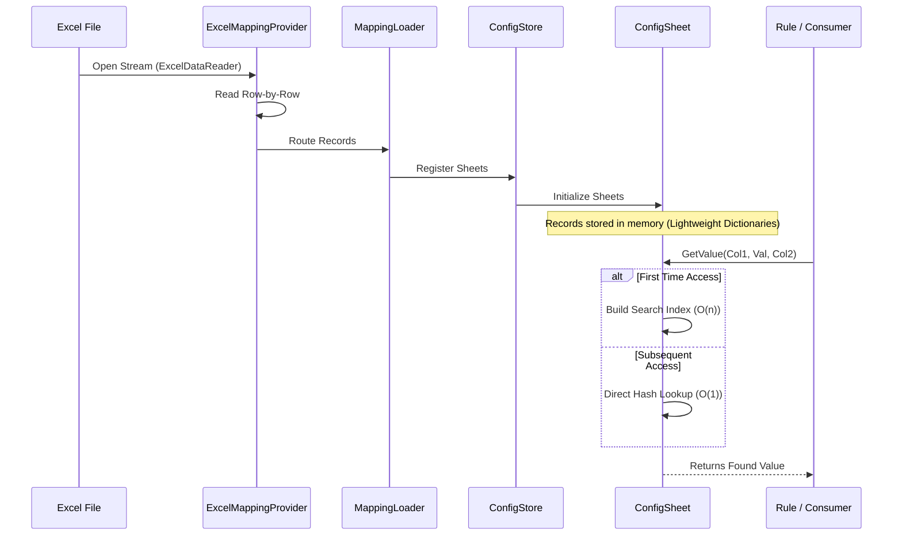

# Configuration Architecture Guide

This project features a high-performance, enterprise-grade configuration system optimized for massive datasets and minimal memory footprint.

## 🏗️ System Architecture

```mermaid
graph TD
    A[Excel File (Config.xlsx)] -->|Stream| B(ExcelMappingProvider)
    B -->|Parse Records| C(MappingLoader)
    C -->|Populate| D[ConfigStore]
    D -->|Contains| E[ConfigSheet: Sheet1]
    D -->|Contains| F[ConfigSheet: Sheet2]
    D -->|Contains| G[ConfigSheet: ...n]
    
    H[MappingConfiguration] -->|Access| D
    I[Rules/Pipeline] -->|Lookup| H
    E -->|Lazy Cache| J[(Search Index Indexing)]
```

## 🔄 Data Flow



## 🚀 Key Features

- **Zero DataTable Dependency**: The memory-intensive `System.Data.DataTable` has been completely replaced with lightweight, record-based storage.
- **Streaming Ingestion**: Excel files are read using a forward-only stream (`ExcelDataReader`), preventing large files from blowing up the RAM.
- **Automated O(1) Indexing**: Complex column-based lookups are automatically indexed on the first hit. Subsequent searches are nearly instantaneous.
- **Unified Access**: All data is accessed via the `ConfigStore`, removing "black box" dictionary logic.

## 🛠️ Components

- **`ConfigStore`**: The central registry. Access it via `config.Store`.
- **`IConfigSheet`**: The interface for interacting with any loaded sheet.
- **`ConfigSheet`**: Implements the automatic indexing and streaming data storage.

## 📖 How to Use

### 1. Simple Key-Value Lookup
Use this when you have a sheet where the first column is a Key and the second is a Value.
```csharp
// Instant access after first hit (cached)
string? val = config.Store.GetSheet("my_sheet")?.GetValue("Key_ABC");
```

### 2. Multi-Column Indexed Lookup
Use this for mapping tables (e.g., matching a `ReasonCode` to a `GroupCode`).
```csharp
// O(1) speed after the first search of this column pair
string? group = config.Store.GetSheet("carc_cagc_mapping")
                      ?.GetValue("ReasonCode", "PR-123", "GroupCode");
```

### 3. Advanced Filtering
```csharp
var matches = config.Store.GetSheet("adjustments")
                    ?.Filter(r => r["Category"] == "Critical");
```

## 📈 How to Scale

### To Add a New Configuration Sheet:
1.  **Update Excel**: Add a new sheet to `Config.xlsx`.
2.  **Add to Loader**: Normalization happens automatically based on the sheet name (spaces become underscores).
3.  **Access in Code**: Use `config.Store.GetSheet("your_sheet_name")`. 

> [!TIP]
> **No code changes are required** to add generic mapping tables. Just add the sheet to Excel and use `GetSheet()` in your rules.

## 🔍 Debugging & Maintenance

- **Log Search**: Look for `Loaded config sheet: [Name] with [X] records`.
- **Case Sensitivity**: Sheet names and column names are case-insensitive.
- **Empty Rows**: The streamer automatically stops at the first fully empty row for efficiency.

---
*Optimized for Memory Efficiency & Speed*
