# EOB to EDI 835 Generator

A high-performance, rule-driven library for converting Explanation of Benefits (EOB) Excel data into HIPAA-compliant EDI 835 Transaction Sets.

## 🚀 Overview

This project provides a robust pipeline to automate the transformation of medical payment data. It leverages **EdiFabric** for EDI generation and a custom **Rules Engine** to handle complex business logic, such as CARC/RARC mapping, balancing, and payer-specific formatting.

## ✨ Key Features

- **Excel-Driven Input**: Automated mapping from multi-sheet Excel workbooks (`payment_header`, `claim_data`, etc.).
- **Dynamic Rules Engine**: Extensible architecture to apply conditional logic at the segment and element level.
- **SNIP Validation**: Integrated multi-level SNIP (Type 1, 2, 3) validation to ensure output compliance.
- **Configurable Mappings**: Externalized mappings via CSV files (`code_defaults.csv`, `carc_master.csv`) for easy maintenance without code changes.
- **Advanced Formatting**:
  - **TRN03 Compliance**: Automatic prefixing and padding for payer identifiers.
  - **Payer Communication**: Dynamic selection of TE/EM/UR qualifiers based on input format.
  - **Global Date Control**: Centralized date formatting (CCYYMMDD) via configuration.

## 🛠 Project Structure

- **`Generator835/`**: The core library.
  - `Generators/`: Handles the assembly of the `TS835` object.
  - `Rules/`: contains `IRuleDefinition` implementations.
  - `Pipeline/`: The orchestrator (`Edi835Pipeline`) that manages the flow from Excel to EDI.
- **`Xalta.Edi.BalancingValidation/`**: specialized library for balancing and SNIP validation.
- **`Xalta.Edi.CodeCrossWalk/`**: efficient O(1) lookup service for code mappings.

## 📁 Directory Structure

- **`/Input`**: Default location for the EOB Excel source file (`Eob_Data.xlsx`).
- **`/Output`**: Default destination for generated `.edi` files.
- **`/Generator835/Config`**: Contains all CSV mapping and settings files.
- **`/Xalta.Edi.BalancingValidation`**: Logic for SNIP validation and balancing rules.

## 📖 How to Use

### 1. Basic Integration
```csharp
var pipeline = new Edi835Pipeline();
var result = pipeline.Execute(
    inputExcelPath: "path/to/eob.xlsx",
    outputDirectory: "path/to/output",
    configDirectory: "path/to/config",
    enableAppsmith: true // Optional: Triggers Appsmith workflow on completion
);

if (result.Success) {
    Console.WriteLine($"EDI Generated: {result.OutputFilePath}");
}
```

### 2. Robust Adjustment Mapping

#### 1. Source Columns & Initial Parsing
The engine performs deep parsing of input strings across **four primary sources**:
 - **`Adjustment Group Code`**: Direct CAGC column from the Excel row.
 - **`Adjustment Reason Code`**: Primary CARC column from the Excel row.
 - **`Line Remark Codes`**: Remark string (e.g., `N115`, `PR2`).
 - **`Line Explanation Codes`**: Explanation string (e.g., `CO45`).

#### 2. Strict Token Pairing (The "Security Guard")
To prevent cross-code infection (e.g., a `CO` code from a different column accidentally applying to a `PR2`), the system uses a **Strict Pairing** logic:
 - **Combined Tokens**: If the input is `PR2` or `CO253`, they are immediately locked as a pair: `(Group: PR, Reason: 2)`.
 - **Lone Tokens**: If a code appears alone (e.g., `96`), it is paired with `null`: `(Group: null, Reason: 96)`. 

This ensures that each reason code only uses the group it was explicitly assigned to in the text.

#### 3. Smart Lookup Hierarchy (ResolveCagc)
When a pair has a `null` group code (or a placeholder like `NA`), the system triggers the **Lookup Engine**:
1.  **Tier 0: Direct Trust**: If a valid EDI group code (CO, PR, OA, PI) is provided in the token, it is used immediately.
2.  **Tier 1: adjustment_group_mapping**: Checks for Payer-specific or EOB-type specific overrides.
3.  **Tier 2: carc_cagc_mapping**: Standard global template fallback. 
4.  **Tier 3: Master Crosswalk**: Final safety resolution using the Master CARC file.

#### 4. The Token Bucket Logic
Specific "special" codes are extracted into a **Token Bucket** and removed from standard adjustment loops to drive the **Math Balancing Engine**:
 - **PR:1** → Deductible
 - **PR:2** → Coinsurance
 - **PR:3** → Copayment
 - **CO:253** → Sequestration 
 - **OA:23** → Other Insurance

#### 4. Symmetric Code Handling:
- **Formats**: `CO45`, `CO 45`, `CO-45` are all treated as Group: `CO`, Reason: `45`.
- **Logic**: If configured as `CO45` but input as `CO` and `45`, it will ### 3. Enterprise-Grade Math Balancing
The engine enforces absolute financial integrity at the service line level. The `MathBalancingRule` guarantees that `Billed - Paid - Sum(Adjustments) = 0`.

#### Core Logic Pipeline (5 Phases):

1. **Phase 1: Preserve and Clear "Owned" Codes**
   - The engine identifies **"Owned" adjustments** (PR-1, PR-2, PR-3, OA-23, CO-45, CO-253, and **any other PR code**).
   - These are temporarily cleared from the source line so they can be precisely recalculated and re-added during the balancing phase.

2. **Phase 2: Sync with Excel Column Amounts**
   - The engine reads direct amounts from the **Deductible, Coinsurance, Copay, Sequestration**, and **Other Insurance** columns.

3. **Phase 3: Patient Responsibility (PR) Priority**
   - **Scenario A (Excel Breakdown):** If specific columns have values, they are emitted as `PR-1`, `PR-2`, or `PR-3`.
   - **Scenario B (Calculated PR):** If no breakdown exists, the system calculates `Gap = Allowed - Paid`.
   - **PR Selection**: If a `PR` code was present in the remark string (e.g., `PR243`), the system uses **that specific code** to carry the calculated patient liability instead of defaulting to `PR3`.

4. **Phase 4: Sequestration (CO-253) Calculation**
   - To prevent penny-off errors, the system uses a **Candidate Test Logic**:
     - Calculates a base candidate: $Allowed \times 0.02$.
     - Tests the **Floor** and **Ceiling** of this value.
     - Selects the one that results in a perfectly balanced `Allowed - Paid` reconciliation.

5. **Phase 5: Gap Resolution & Contractual (CO-45)**
   - **Final Gap**: `Gap = Billed - Paid - Sum(all emitted adjustments)`.
   - **CO-45 Emission**: Any remaining positive difference is emitted as `CO-45`. Any final "rounding dust" (< $0.01) is absorbed into this segment.

---

### 4. Patient Responsibility (PR) Correction
The `PatientResponsibilityFixerService` ensures the total Patient Responsibility (PR) amount is mathematically consistent with the individual Copay, Deductible, and Coinsurance breakdowns.

- **The Validation**: The service sums the the Excel breakdown columns (**Copay + Coinsurance + Deductible**).
- **The Correction Logic**: If this breakdown sum **does not match** the raw PR amount but **does match** the `Allowed - Paid` calculation (accounting for Sequestration), the system corrects the total PR amount to match the breakdown sum.
- **Claim Synchronization**: After fixing service lines, the system automatically recalculates the **Claim Level Total PR** (CLP05) by summing all service line PR values, ensuring perfect vertical balancing.

---

### 5. Swapped Column Detection
The `SwapDetectionService` prevents incorrect EDI generation when the `Allowed Amount` and `Adjustment Amount` columns are likely swapped (a common OCR/data entry error).

- **The Cross-Check**:
  - The service performs a reconciliation against the **Raw Excel Patient Responsibility (PR)** and the claim-level **CLP05**.
  - It calculates `Test Allowed = Paid + PR + Sequestration`.
  - If `Test Allowed` matches the value in the **Adjustment** column (while the Billed amount remains the same), a **Swap is Confirmed**.
- **The Short-Circuit**: 
  - Once a swap is detected, the line is flagged as **Invalid**.
  - The pipeline switches to **Mapping-only mode** for that line, preserving the raw data and placing the final file in the `Invalid` folder for human review, rather than attempting to balance on "garbage" data.

---

### 6. Appsmith Integration
When `enableAppsmith` is set to `true`, the pipeline delivers a structured JSON payload to the configured endpoint.

#### Features:
- **Parsed EDI Data**: Instead of raw text, it sends a collection of `IEdiItem` objects (ST, BPR, CLP, etc.) for easy downstream processing.
- **Structured Errors**: Validation errors are sent as a JSON array with full metadata.
- **Resilience**: Integrated retry logic (3 retries) with exponential backoff and 10-second timeouts.

#### Payload Example:
```json
{
  "parsed_edi_data": [ { "$type": "...", "ST_01": "835", ... } ],
  "validation_errors": [ "CLP segment missing required element...", ... ],
  "fileName": "835_0001_2026.edi",
  "success": true
}
```

### 7. Configuration Guide

The generator uses a set of CSV files in the `Config` directory to control EDI output without modifying code.

#### `edi_settings.csv`
Controls global EDI infrastructure and processing parameters.
- **Key Settings**:
  - `Appsmith_ApiUrl`: The destination URL for the workflow.
  - `Appsmith_ApiKey`: Authentication key.
  - `ISA_SenderIDQualifier`: Qualifier for Payer ID (e.g., `ZZ`).
  - `GS_VersionAndRelease`: The EDI version string (e.g., `005010X221A1`).
  - `DateFormat`: The format used for all date elements (default: `yyyyMMdd`).

#### `adjustment_group_mapping.csv`
The primary high-priority mapping table.
- **Columns**: `EOB Type`, `AdjustmentText`, `CAGC`, `CARC`
- **Logic**: Matches Payer names to `EOB Type` and parses `AdjustmentText` to find both codes.

#### `carc_cagc_mapping.csv`
The master cross-walk for Claim Adjustment Reason Codes (CARC).
- **Columns**: `ReasonCode`, `GroupCode`, `Description`
- **Usage**: Automatically determines the `CAS01` Group Code based on the `CAS02` Reason Code.

#### `currency_map.csv`
Maps Excel currency symbols to ISO 4217 Currency Codes.
- **Example**: `$` resolves to `USD` for the `CUR` segment.

### 8. Excel Configuration (Alternative)

Instead of multiple CSV files, you can use a single **Excel workbook (`Config.xlsx`)**.

- **Auto-Detection**: The pipeline automatically detects if you pass a file path ending in `.xlsx` or `.xls`.
- **Structure**: Each sheet in the workbook corresponds to a CSV file (e.g., sheet `edi_settings` works like `edi_settings.csv`).

---

## 🧬 Adding New Columns to the Workflow

The system is designed to be **fully dynamic** for tracking extra data in the interim Excel file without code changes.

### Steps to Add a New Column:
1.  **CSV Source**: Add the new column to your input CSV (e.g., `Internal_Note`).
2.  **Excel Template**: Manually add a matching header to your Excel template (`Eob_Template.xlsx`) in the desired sheet (e.g., `claims`).
3.  **Config Mapping**: Add a row to the `csv_mapper` sheet in your `Config.xlsx` (or `csv_mapper.csv`):
    *   `CsvColumn`: `Internal_Note`
    *   `TargetSheet`: `claims`
    *   `TargetColumn`: `Internal Note` (The mapper normalizes spaces/underscores, so `Internal Note` matches `Internal_Note`).

> [!IMPORTANT]
> **Limitations**: 
> - The dynamic mapper only fills the **Excel file**. 
> - Downstream components (`EobExcelReader` and `Edi835Generator`) use a fixed data model. New columns will be **ignored** by the EDI generator unless the C# code (Model and Reader) is also updated.
> - For **Service Lines**, the mapper aggregates multiple rows. New fields will take the **first non-blank value** from the CSV and will not append/sum them.

---

## 🔄 Pipeline Execution Flow

This diagram illustrates the complete end-to-end process from raw payer data to standardized EDI output.

```mermaid
graph TD
    %% Inputs
    Input[("Raw EOB Excel<br/>(Sources: Grp, Reason, Remark, Expl)")]

    %% Stage 1: Parsing
    subgraph "1. Intelligent Parsing & Pairing"
        Tokenize["Tokenize & Clean<br/>(OCR fixes, Placeholder strip)"]
        Pairing["Strict Pairing<br/>(e.g. PR2 stays PR)"]
        Lookup["Smart Lookup Hierarchy<br/>(ResolveCagc Tiers 0-3)"]
    end

    %% Stage 2: Normalization
    subgraph "2. Data Normalization"
        Bucket["Token Bucketing<br/>(PR1/2/3, CO253, OA23)"]
        Dedupe["Deduplication<br/>(Group by CAGC+CARC)"]
        Swap["Swap Detection<br/>(Allowed vs Adjustment)"]
    end

    %% Stage 3: Integrity
    subgraph "3. Financial Integrity (MathBalancingRule)"
        ClearOwned["Clear Owned Adjustments"]
        SyncExcel["Sync with Column Amounts"]
        BalancePR["Balance PR Liability<br/>(Calculated vs Remark Code)"]
        SeqCalc["Sequestration Logic<br/>(Floor/Ceiling Candidate Test)"]
        GapRes["Gap Resolution<br/>(CO45 & Rounding Dust)"]
    end

    %% Stage 4: Generation
    subgraph "4. EDI Assembly & Validation"
        EDIGen["EdiFabric TS835 Construction"]
        SNIP["Compliance Check<br/>(SNIP 3 & 4)"]
    end

    %% Outputs
    Valid[("Valid Folder")]
    Invalid[("Invalid Folder")]
    Appsmith["Appsmith Payload<br/>(Parsed JSON + metadata)"]

    %% Connections
    Input --> Tokenize
    Tokenize --> Pairing
    Pairing --> Lookup
    Lookup --> Bucket
    Bucket --> Dedupe
    Dedupe --> Swap
    Swap --> ClearOwned
    ClearOwned --> SyncExcel
    SyncExcel --> BalancePR
    BalancePR --> SeqCalc
    SeqCalc --> GapRes
    GapRes --> EDIGen
    EDIGen --> SNIP
    SNIP -- "Pass" --> Valid
    SNIP -- "Fail" --> Invalid
    Valid --> Appsmith
    Invalid --> Appsmith
```



### Business Flow Highlights

1.  **Configuration Driven**: The system uses payer-specific JSON rules and a "Master Crosswalk" to ensure data is mapped correctly for every insurance provider.
2.  **Intelligent Data Cleanup**: Normalizes inconsistent data and detects common human errors (like swapped "Allowed" vs "Adjustment" amounts) before they enter the medical record.
3.  **Audit Visibility**: Updates the input Excel (Canonical Template) with resolved values, allowing humans to audit exactly how the system balanced the math.
4.  **Standardized Output**: Converts complex payments into formal EDI 835 healthcare transactions.
5.  **Multi-Level Validation**: Runs SNIP 3 & 4 checks—the gold standard for healthcare data compliance—to ensure no invalid files are sent to payers.
6.  **Full Automation Cycle (A360)**:
    -   **Trigger**: Instantly alerts the automation bot of the results.
    -   **Deploy**: The A360 platform deploys the necessary bot workers.
    -   **DB Update**: The database/system of record is automatically updated, completing the enterprise transaction loop.

---

## ✅ Verification
Run tests to ensure compliance after any changes:
- **Unit Tests**: `dotnet test --filter Category=Rules`
- **Integration Tests**: `dotnet test --filter Category=Pipeline`
- **Appsmith Test**: `dotnet test --filter Name~Appsmith`
