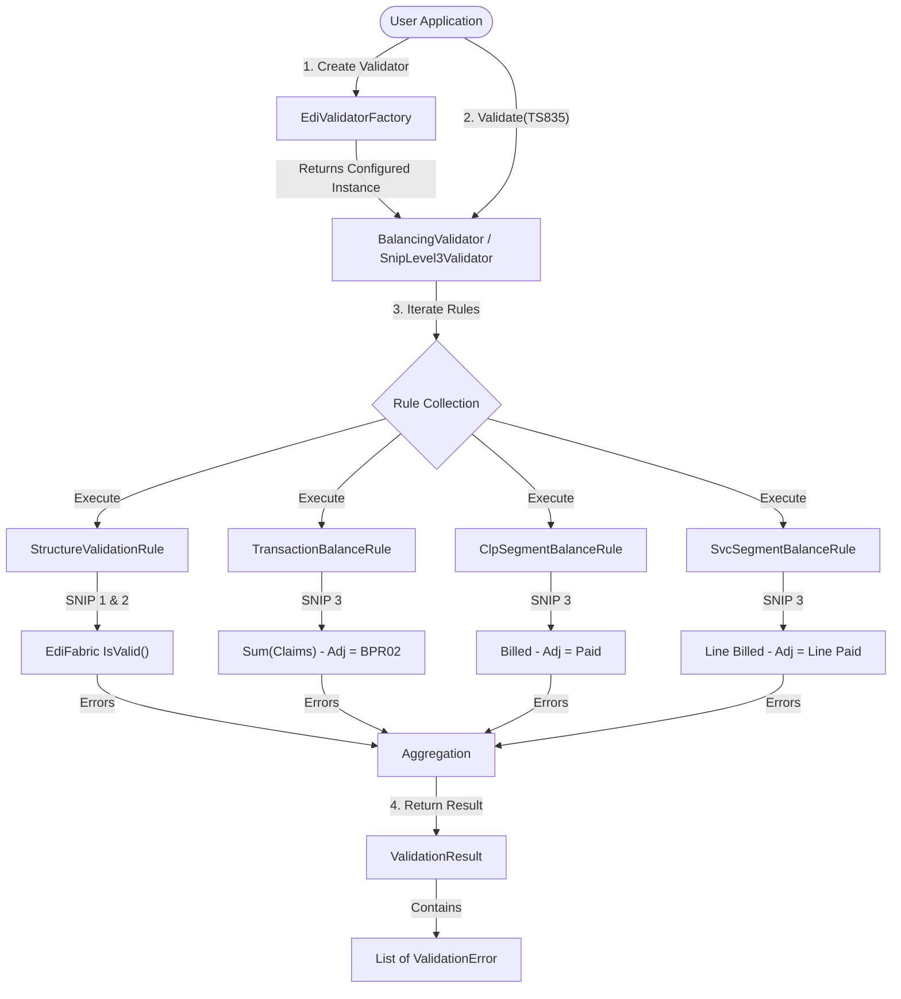

# EDI 835 Balancing Validator System

## Overview
The **Xalta.Edi.BalancingValidation** library is a robust, enterprise-grade validation engine for EDI 835 (Health Care Claim Payment/Advice) transactions. It extends the core structural validation provided by EdiFabric with specialized mathematical balancing rules required for SNIP Level 3 compliance.

## Architecture
The system is built on **SOLID principles** to ensure maintainability and scalability.

- **`IBalancingValidator<T>`**: The main engine that executes a collection of rules.
- **`IBalancingRule<T>`**: Interface for individual validation logic (e.g., Transaction Balancing).
- **`IBalancingFixer`**: **NEW!** A centralized service that encapsulates all mathematical formulas, used by both the Validator and the EDI Generator to ensure consistency.
- **`EdiValidatorFactory`**: A static factory to easily instantiate validators configured for specific SNIP levels.
- **`ValidationResult`**: A structured response object containing validity status and detailed error information.

## Latest Updates (February 2026)
- **Centralized Logic**: Created the `IBalancingFixer` service to provide a single point of truth for all mathematical calculations.
- **Formula Consolidation**: Strictly applied the "Perfect Rules" formulas for SVC, CLP, and Transaction levels.
- **Proactive & Reactive Consistency**: The same logic is now shared between the `Xalta.Edi.Generation` rules engine and the `Xalta.Edi.BalancingValidation` library.

## Validation Levels (SNIP)
The library supports configurable validation levels:

| Level | Description | Implementation |
| :--- | :--- | :--- |
| **SNIP 1** | **Integrity**: Basic syntax and standard compliance. | `StructureValidationRule` (SyntaxOnly) |
| **SNIP 2** | **Requirement**: Data types, min/max lengths, required fields. | `StructureValidationRule` (LimitsAndCodes) |
| **SNIP 3** | **Balancing**: Complex mathematical relationships between segments. | `SnipLevel3Validator` (Includes SNIP 2 + Custom Rules) |

## Validation Flow
The following diagram illustrates how the validator processes a transaction:



## Structured Results
Instead of simple error strings, the validator returns rich `ValidationError` objects, easier for APIs to consume:

```csharp
public class ValidationError
{
    public string ErrorCode;       // e.g., "BAL_TRN_001"
    public string Message;         // "Transaction balancing failed..."
    public ValidationSeverity Severity; // Error, Warning, Info
    public string SegmentName;     // "BPR"
    public string ElementReference;// "BPR02"
    public string ContextInfo;     // "ClaimID: 12345"
}
```

## Quick Start Guide

To use the validator, you involve three main steps: **Reading/Parsing** the EDI file, **Validating** it against a SNIP level, and **Handling** the structured results.

### 1. Installation & Setup
Ensure your project references `Xalta.Edi.BalancingValidation.dll` and the required **EdiFabric** NuGet packages and templates.

### 2. Basic Usage (Parsing + Validation)

```csharp
using EdiFabric.Framework.Readers;
using EdiFabric.Templates.Hipaa5010;
using Xalta.Edi.BalancingValidation;

// Step A: Parse the EDI File
TS835 transaction;
using (var stream = File.OpenRead("claim835.edi"))
using (var reader = new X12Reader(stream, "EdiFabric.Templates.Hipaa"))
{
    // Skip to the transaction (ST segment)
    transaction = reader.Read() as TS835;
}

// Step B: Create a SNIP 3 (Balancing) Validator
var validator = EdiValidatorFactory.CreateSnip3();

// Step C: Validate
var result = validator.Validate(transaction);

// Step D: Report
if (!result.IsValid)
{
    foreach (var error in result.Errors)
    {
        Console.WriteLine($"Error [{error.ErrorCode}] in {error.SegmentName}: {error.Message}");
    }
}
```

---

## Detailed Configuration

### SNIP Level Matrix
The factory allows you to choose exactly how strict you want to be:

| Method | Target | Checks Performed |
| :--- | :--- | :--- |
| `CreateSnip1()` | **Syntax** | Basic EDI segments, separators, and envelope integrity. |
| `CreateSnip2()` | **Schema** | Data types, required fields, and min/max length constraints. |
| `CreateSnip3()` | **Balancing** | Everything in SNIP 2 + mathematical balancing of Billed vs. Paid. |

### Handling Structured Results
The `ValidationError` object is designed for easy consumption in UI and APIs:

```csharp
// Example: Converting to an API-friendly response
var apiResponse = new {
    Status = result.IsValid ? "Passed" : "Failed",
    Issues = result.Errors.Select(e => new {
        Code = e.ErrorCode,
        Msg = e.Message,
        Ref = e.ElementReference,
        Path = $"{e.SegmentName} (Line Context: {e.SegmentPosition})"
    })
};
```

---

## Implemented Mathematical Rules

The validator implements several crucial balancing checks:

### 1. Transaction Reconciliation (`BAL_TRN_003`)
Ensures the check amount (`BPR02`) matches the sum of all claims minus any provider-level adjustments (`PLB`).
> **Formula:** `Sum(2100 CLP04) - Sum(PLB04, PLB06, PLB08, PLB10, PLB12, PLB14) = BPR02`

### 2. Claim-Level Balancing (`BAL_CLP_001`)
Ensures that for every claim (`CLP`), the Paid amount correctly accounts for the Billed amount and all associated adjustments (both at the claim level and service line level).
> **Formula:** `CLP03 - (Sum(2100 CAS) + Sum(2110 CAS)) = CLP04`

### 3. Service line Balancing (`BAL_SVC_001`)
Ensures that for every service line (`SVC`), the paid amount matches the billed amount minus line-level adjustments.
> **Formula:** `SVC02 - Sum(2110 CAS03, CAS06, CAS09, CAS12, CAS15, CAS18) = SVC03`

---

## Technical: IBalancingFixer Usage

For developers needing to perform calculations manually or within a separate rules engine (like the `SpecificPayerRule` or `MathBalancingRule` in the generator):

```csharp
using Xalta.Edi.BalancingValidation.Core;
using Xalta.Edi.BalancingValidation.Interfaces;

// 1. Instantiate or Inject the Fixer
IBalancingFixer fixer = new BalancingFixer();

// 2. Perform consolidated calculations
decimal requiredSvcPaid = fixer.CalculateSvc03(lineBilled, lineAdjustments);
decimal requiredClpPaid = fixer.CalculateClp04(claimBilled, claimAdj, svcAdj);
decimal requiredBprTotal = fixer.CalculateBpr02(sumOfClp04, sumOfPlb);

// 3. Perform balance checks with tolerance
bool isBalanced = fixer.IsBalanced(billed, paid, adjustments);

---

## Configuring Balancing Tolerance (Alpha)

In some cases, minor discrepancies (e.g., due to rounding) should be ignored. You can configure the global balancing tolerance using the `Alpha` property.

### Global Configuration
The default `Alpha` is `0.01`. You can change it globally on the fixer instance:

```csharp
var fixer = new BalancingFixer { Alpha = 0.05m }; // Allow up to 5 cents discrepancy

// All rules using this fixer will now respect the new Alpha
var validator = new BalancingValidator<TS835>();
validator.AddRule(new TransactionBalanceRule(fixer));
validator.AddRule(new ClpSegmentBalanceRule(fixer));
```

### Method-Level Override
You can also override the tolerance for a specific call:

```csharp
// Ignores Alpha and uses 0.10 just for this check
bool balanced = fixer.IsBalanced(billed, paid, adjustments, tolerance: 0.10m);
```
```

---

## Automation Anywhere (A360) Integration

The DLL includes a specialized wrapper for RPA developers.

### DLL Configuration in A360
- **Action**: `DLL: Open`
- **File path**: `PATH_TO_DLL\Xalta.Edi.BalancingValidation.dll`

### 1. Initialize License (Optional)
If you have an EdiFabric license key, run this once at the start:
- **Namespace**: `Xalta.Edi.BalancingValidation.Integration`
- **Class**: `A360Validator`
- **Function**: `SetLicense`
- **Parameter**: `key` (String)

### 2. Validate File
Run this for every EDI file you process:
- **Namespace**: `Xalta.Edi.BalancingValidation.Integration`
- **Class**: `A360Validator`
- **Function**: `ValidateFile`
- **Parameters**: 
    - `filePath`: (String) Absolute path to the EDI file.
    - `snipLevel`: (Number) 1, 2, or 3.
- **Return Value**: String (JSON)

### Handling the JSON Output
The `ValidateFile` function returns a JSON string. You can use the **JSON: Start session** and **JSON: Get node value** actions in A360 to parse it:

```json
{
  "isValid": false,
  "snipLevelUsed": 3,
  "errors": [
    {
      "code": "BAL_CLP_001",
      "message": "Claim 5554555444 balancing failed. CLP04 (Paid) is 30, but should be 500...",
      "segment": "CLP",
      "position": -1,
      "reference": "CLP04"
    }
  ]
}
```

---

## Testing the System
The project includes a comprehensive test suite in **Xalta.Edi.BalancingValidation.Tests**.

1.  Place sample `.edi` files in the `Input` folder.
2.  Run the tests using the CLI:
    ```powershell
    dotnet test --filter "FullyQualifiedName~FileBasedValidationTests"
    ```
3.  The tests will iterate through all files and report SNIP 1, 2, and 3 status for each.

